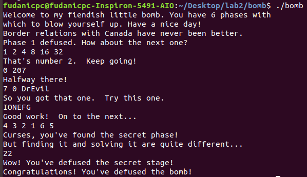
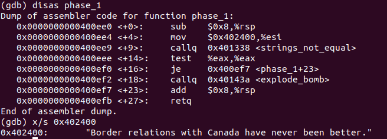
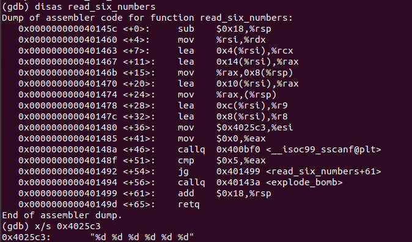
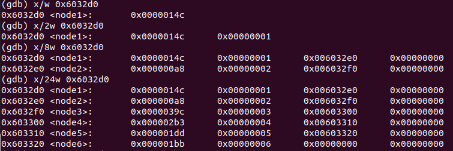
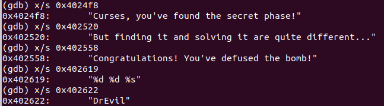
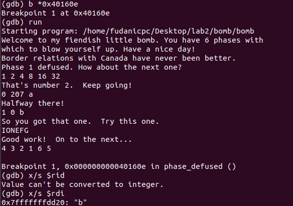
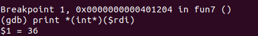
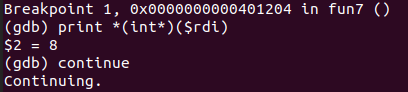
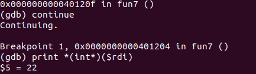

# ICSⅠ Lab2 报告

计算机科学与技术

19307130296

孙若诗

## 运行截图

  

## 密码答案

列举多组表示多种答案均可行。

对于Phase_1、Phase_5，格式必须和下列答案一致。对于Phase_2、3、4、6，secret等，由于使用%d读入整数，可以自动忽略多余空格，但回车仍旧是不可接受的。

1. **Phase_1: string comparison**
Border relations with Canada have never been better.

2. **Phase_2: loops**
1 2 4 8 16 32

3. **Phase_3: conditionals/switches**
0 207 / 1 311 / 2 207 / 3 256 / 4 389 / 5 206 / 6 682 / 7 327

4. **Phase_4: recursive calls and the stack discipline**
0 0 / 1 0 / 3 0 / 7 0
进入Secret_Phase需要在后面空一格加 DrEvil。

5. **Phase_5: pointers**
IONEFG/yo^uvw等任何ASCII码后四位依次为9、F、E、5、6、7的六位字符串。

6. **Phase_6: linked lists/pointers/structs**
4 3 2 1 6 5

7. **Secret_phase**
22

## 解题过程

* **Pre**

&emsp;&emsp;对照bomb.c观察main函数。基本模式为调用read_line，将返回值%rax赋给%rdi，调用phase_i，重复6次。

&emsp;&emsp;阅读read_line，可以推测它的功能是读入一行字符串，返回值为字符串首地址。

&emsp;&emsp;explode_bomb为引爆炸弹，lab目标为跳过此函数。

* **Phase_1: string comparison**

&emsp;&emsp;阅读Phase_1函数，发现0x400ee4处将0x402400赋给%esi。下一行即调用string_not_equal，其返回值为0则可跳过explode_bomb。

&emsp;&emsp;阅读string_not_equal，发现它的功能和名字一样，就是先比较%rdi和%rsi长度是否相等，再按位比较。若两个字符串相等则返回0。

&emsp;&emsp;因此我们想拆除炸弹，就是要输入一个和%esi相同的字符串，显然可以用gdb输出0x402400地址所存储的内容，具体操作如下。

&emsp;&emsp;因此第一个炸弹的密码即为Border relations with Canada have never been better.

* **Phase_2: loops**

&emsp;&emsp;阅读phase_2，发现它首先调用了read_six_numbers，并且在调用之前将栈顶%rsp赋给%rsi。根据名字猜想这个函数用途为读6个数字，用gdb输出该函数中的0x4025c3地址中字符串，印证猜想。具体阅读汇编语句，发现它将6个数放在了%rsi开始的连续6个4byte中。

&emsp;&emsp;回到phase_2的汇编语句，发现它首先比较了%rsp中值是否等于1，等于才能跳过explode_bomb。之后开始循环，从第二位开始，每次取出上一位并乘2，比较结果和当前位是否相同，不同则炸弹爆炸，反复五次。

&emsp;&emsp;因此为了拆除炸弹，我们需要输入6个整数，以1为开始，后一位是前一位的2倍，即1 2 4 8 16 32。

* **Phase_3: conditionals/switches**

&emsp;&emsp;和上一问一样，首先输出0x4025cf中的字符串，发现它是%d %d，说明我们在这里需要输入2个整数。后续代码也验证了只有当输入整数为2个时才能绕过炸弹。

&emsp;&emsp;之后的语句检查了第一个输入值是否小于等于7，若大于7则引爆炸弹。

&emsp;&emsp;再下一句jmpq根据第一个输入值跳转到不同地址，获取一个新的数之后跳转到函数结尾，比较获取的值和第二个输入值是否相等，不相等则引爆炸弹。

&emsp;&emsp;可以看出这个函数的结构相当于一个switch语句，只要第一个输入值和第二个输入值配套就能拆除炸弹。因此通过gdb输出，或者直接依次尝试，得出8组可行的解。

* **Phase_4: recursive calls and the stack discipline**

&emsp;&emsp;阅读phase_4，发现它仍旧读入两个整数，且整数数量不为2时会引爆炸弹。若第一个数大于14或第二个数不为0也会引爆炸弹。考虑到一共只有十五种方案，我预先通过枚举确定了四组答案。

&emsp;&emsp;具体分析func4，在调用它之前已经将%esi设为0，%edx设为14，%edi为第一个读入的数。将func4翻译为C语言如下：

~~~C
int func4(int x, int y, int z) {
    int a1 = z - y;
    int a2 = a1 >> 31;
    a1 = (a1 + a2) >> 1;
    a2 = a1 + y;
    if(a2 <= x) {
        a1 = 0;
        if(a2 >= x)  return a1;
        return 2 * func(x, a2 + 1, z) + 1;
    }
    return 2 * func4(x, y, a2 - 1);
}
~~~

&emsp;&emsp;拆弹的目的是让这个函数返回值为0。0、1、3、7是满足条件的解。

* **Phase_5: pointers**

&emsp;&emsp;阅读phase_5，首先习惯性地输出两个可疑地址0x4024b0和0x40245e，发现前者为一个长字符串，后者为flyers。

&emsp;&emsp;按执行顺序阅读程序，首先调用string_length，如果字符串长度不为6就引爆炸弹。然后执行了六次循环，依次取出字符串中的一位，将它与15作为在长字符串中取字符的偏移值，把取到的数依次放入%rsp为开头的一段栈中。最后检查取出的字符串是否和flyers相等，若相等则炸弹拆除。

&emsp;&emsp;观察长字符串中，flyers分别为第9、F、E、5、6、7位，因此只需要输入的字符串与15和上述数列相同。字符串对应的16进制数可通过man ascii指令查询。

* **Phase_6: linked lists/pointers/structs**

&emsp;&emsp;阅读phase_6，发现它再次调用read_six_numbers。读入后循环检查6个数，先检查它是否大于6，再检查其他数是否和它相等，若大于6或者有重复则引爆炸弹，说明要求这是一个1-6的排列。之后程序将每个数x都转换为了7-x。

&emsp;&emsp;然后发现又有一个可疑的地址0x6032d0，尝试输出后发现它大概每个node有4个数，于是对应输入的6个数字，输出24个数，显然它应当为一个结构体。

&emsp;&emsp;阅读代码发现它要按照结构体的第一个变量排序，使得排序后第二个变量和我们处理过的7-x依次相等。结构体里第一维从大到小的顺序为3 4 5 6 1 2，则输入应为4 3 2 1 6 5。

* **Secret_phase**

&emsp;&emsp;最后用Ctri+F寻找哪里调用了secret_phase，发现是在phase_defused。输出调用前后的几个字符串如下，说明有一个位置输入了两个int和一个字符串，如果字符串等于DrEvil，则可以解开秘密关卡。

&emsp;&emsp;回忆解题过程，我们在phase_3、4均输入了两个int，但是究竟哪个位置才是目标位置，不妨分别在两个位置输入a和b，然后用gdb在phase_defused设置断点，输出%rdi，如下图结果为b，说明应当在phase_4答案后空一格输入DrEvil。

&emsp;&emsp;进入秘密关卡后发现它要求输入一个数，以它为第二个参数，36为第一个参数调用func7，如果结果为2则拆除炸弹。将func7翻译成C语言如下：

~~~C
int func7(int *x, int y) {
    if(x == 0)  return 0xffffffff;
    if(*x <= y) {
        if(*x == y)  return 0;
        return 2 * func7(*(x + 16), y) + 1;
    }
    return 2 * func(*(x + 8));
}
~~~

&emsp;&emsp;可以发现，为了得到2，我们需要第一层返回0，第二层返回1，第三层返回2。y是我们输入的值，分别输入满足上一层要求的值以进入下一层，用gdb在三层输出*x内的值，第一层要求y<36，第二层要求y>8，第三层直接给出y=22。

## 实验总结

1. 认识到了gdb工具的方便强大。之前由于不得不经常适应不同的IDE和比赛环境，一直被严格限制gdb的使用，避免产生依赖性。这次lab才第一次使用gdb，感觉它的断点、单步调试和输出功能确实非常方便。

2. 熟悉了汇编语言的指令，体会了组织汇编语言的方法。

3. read_line的好处在于读入了一行字符之后，后续可以再次用read_six_numbers等函数反复处理，给secret_phase的隐藏留下了空间。

4. 由于lab2、lab3是接连做的，写完lab3的报告再来写lab2报告，忽然觉得对汇编的具体细节清楚了很多，这可能就是“读”与“用”之间的差距吧。
