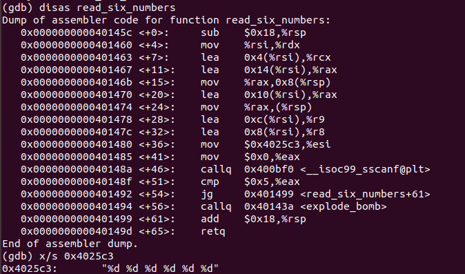
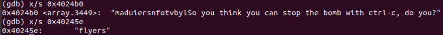
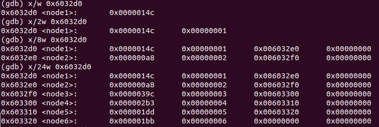
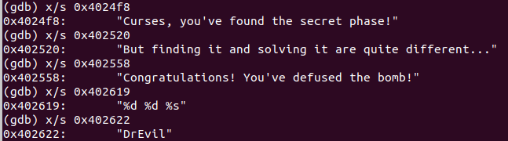
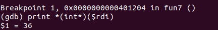

#  ICSⅠ Lab2 报告
  
  
计算机科学与技术
  
19307130296
  
孙若诗
  
##  运行截图
  
  
  
  
##  密码答案
  
  
列举多组表示多种答案均可行。
  
对于Phase_1、Phase_5，格式必须和下列答案一致。对于Phase_2、3、4、6，secret等，由于使用%d读入整数，可以自动忽略多余空格，但回车仍旧是不可接受的。
  
1. **Phase_1: string comparison**
Border relations with Canada have never been better.
  
2. **Phase_2: loops**
1 2 4 8 16 32
  
3. **Phase_3: conditionals/switches**
0 207 / 1 311 / 2 207 / 3 256 / 4 389 / 5 206 / 6 682 / 7 327
  
4. **Phase_4: recursive calls and the stack discipline**
0 0 / 1 0 / 3 0 / 7 0
进入Secret_Phase需要在后面空一格加 DrEvil。
  
5. **Phase_5: pointers**
IONEFG/yo^uvw等任何ASCII码后四位依次为9、F、E、5、6、7的六位字符串。
  
6. **Phase_6: linked lists/pointers/structs**
4 3 2 1 6 5
  
7. **Secret_phase**
22
  
##  解题过程
  
  
* **Pre**
  
&emsp;&emsp;对照bomb.c观察main函数。基本模式为调用read_line，将返回值%rax赋给%rdi，调用phase_i，重复6次。
  
&emsp;&emsp;阅读read_line，可以推测它的功能是读入一行字符串，返回值为字符串首地址。
  
&emsp;&emsp;explode_bomb为引爆炸弹，lab目标为跳过此函数。
  
* **Phase_1: string comparison**
  
&emsp;&emsp;阅读Phase_1函数，发现400ee4处将0x402400赋给%esi。下一行即调用string_not_equal，其返回值为0则可跳过explode_bomb。
  
&emsp;&emsp;阅读string_not_equal，发现它的功能和名字一样，就是先比较%rdi和%rsi长度是否相等，再按位比较。若两个字符串相等则返回0。
  
&emsp;&emsp;因此我们想拆除炸弹，就是要输入一个和%esi相同的字符串，显然可以用gdb输出0x402400地址所存储的内容，具体操作如下。

  
&emsp;&emsp;因此第一个炸弹的密码即为Border relations with Canada have never been better.
  
* **Phase_2: loops**
  
&emsp;&emsp;阅读phase_2，发现它首先调用了read_six_numbers，并且在调用之前将栈顶%rsp赋给%rsi。根据名字猜想这个函数用途为读6个数字，用gdb输出该函数中的0x4025c3地址中字符串，印证猜想。具体阅读汇编语句，发现它将6个数放在了%rsi开始的连续6个4byte中。
  

  
&emsp;&emsp;回到phase_2的汇编语句，发现它首先比较了%rsp中值是否等于1，等于才能跳过explode_bomb。之后开始循环，从第二位开始，每次取出上一位并乘2，比较结果和当前位是否相同，不同则炸弹爆炸，反复五次。
  
&emsp;&emsp;因此为了拆除炸弹，我们需要输入6个整数，以1为开始，后一位是前一位的2倍，即1 2 4 8 16 32。
  
* **Phase_3: conditionals/switches**
  
&emsp;&emsp;和上一问一样，首先输出0x4025cf中的字符串，发现它是%d %d，说明我们在这里需要输入2个整数。后续代码也验证了只有当输入整数为2个时才能绕过炸弹。
  
&emsp;&emsp;之后的语句检查了第一个输入值是否小于等于7，若大于7则引爆炸弹。
  
&emsp;&emsp;再下一句jmpq根据第一个输入值跳转到不同地址，获取一个新的数之后跳转到函数结尾，比较获取的值和第二个输入值是否相等，不相等则引爆炸弹。
  
&emsp;&emsp;可以看出这个函数的结构相当于一个switch语句，只要第一个输入值和第二个输入值配套就能拆除炸弹。因此通过gdb输出，或者直接依次尝试，得出8组可行的解。
  
* **Phase_4: recursive calls and the stack discipline**
  
* **Phase_5: pointers**
  

  
* **Phase_6: linked lists/pointers/structs**
  

  
* **Secret_phase**
  

  
##  实验总结
  
  
1. 认识到了gdb工具的方便强大。之前由于不得不经常适应不同的IDE和比赛环境，一直被严格限制gdb的使用，避免产生依赖性。因此这次lab才第一次使用gdb，感觉它的断点、单步调试和输出功能确实非常方便。
  
2. read_line的好处在于读入了一行字符之后，后续可以再次用read_six_number等函数反复处理，给secret_phase的隐藏留下了空间。
  
3. 由于lab2、lab3是接连做的，写完lab3的报告再来写lab2报告忽然觉得对汇编的具体细节清楚了很多，这可能就是“读”与“用”之间的差距吧。
  