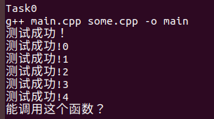
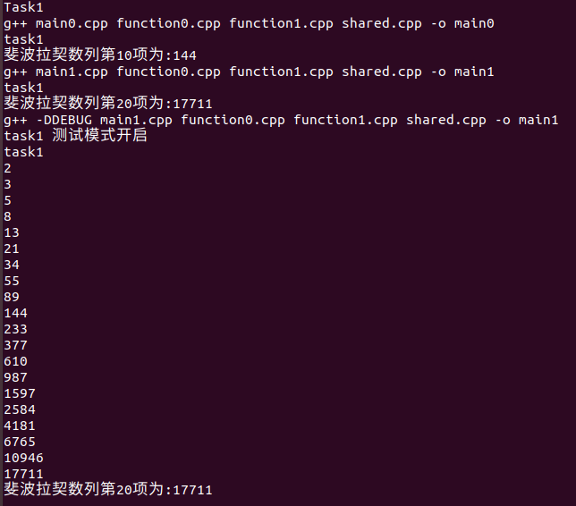
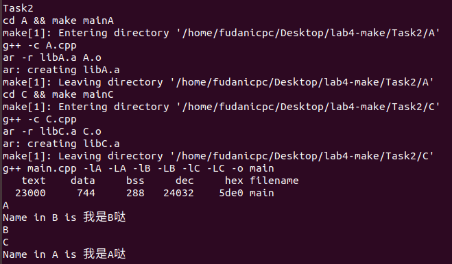
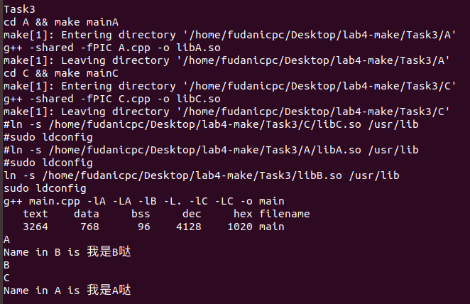
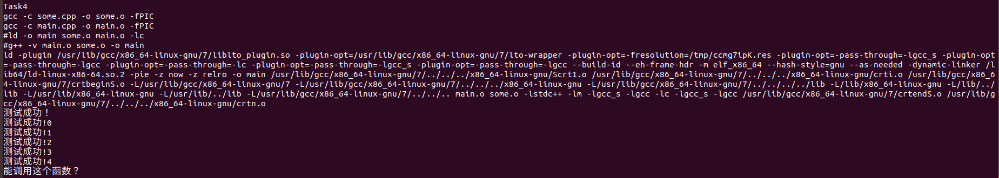
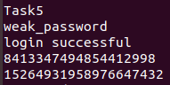

# ICSⅠ Lab4 报告

计算机科学与技术
19307130296
孙若诗

注：此报告中的引用均为笔者日后查阅复习，助教若为节省批阅时间，可忽略引用部分。感谢您的阅读。

## 运行截图

* **Task 0**

&emsp;&emsp;
* **Task 1**

&emsp;&emsp;
* **Task 2**

&emsp;&emsp;
* **Task 3**

&emsp;&emsp;
* **Task 4**

&emsp;&emsp;
* **Task 5(H)**

&emsp;&emsp;

## 问题解答

* **Task 0**

1. 代码中的错误是什么？
&emsp;&emsp;main.cpp调用了notATest函数，但是some.h头文件里没有声明。

* **Task 1**

1. 为什么两个function.h都引⽤了shared.h⽽没有出问题？本来有可能出什么问题。
&emsp;&emsp;因为shared.h没有定义全局变量。
&emsp;&emsp;本来shared.h定义的全局变量可能会在编译时被重复定义，导致出错。
&emsp;&emsp;
2. 如果把shared.h中注释掉的变量定义取消注释会出什么问题？为什么？
&emsp;&emsp;会导致编译出错。
&emsp;&emsp;因为它定义了全局变量并且赋了初值，main0.cpp包含了function0.h和function1.h，而这两个头文件都包含了shared.h，这意味着shared.h会被包含两次，定义也就发生了两次；变量定义的重复是不可接受的。
&emsp;&emsp;
3. 通常使⽤shared.h中另外被注释掉的宏命令(#开头的那些⾏)来规避重复引⽤的⻛险，原理是什么？取消这些注释之后上⼀题的问题解除了吗？不管解没解除背后的原因是什么？
&emsp;&emsp;判断是否定义过这个变量，未定义时才定义，使定义在每个源文件编译时只发生一次。
&emsp;&emsp;上一问在单文件编译时的问题解决了，但是链接时仍旧会出现问题，因为链接过程发生在编译之后，多个源文件共同编译时仍旧会重复定义。

* **Task 2**

1. 若有多个静态链接库需要链接，写命令时需要考虑静态链接库和源⽂件在命令中的顺序吗？是否需要考虑是由什么决定的？
&emsp;&emsp;需要，源文件必须放在最前面，静态库之间的顺序也可能需要考虑。
&emsp;&emsp;是否需要考虑由静态链接库之间有无依赖关系决定。链接器的传统行为是在命令行中指定的库从左到右搜索外部函数，因此被依赖的静态链接库应当放在右边。
&emsp;&emsp;
2. 可以使⽤size main命令来查看可执⾏⽂件A所占的空间，输出结果的每⼀项是什么意思？
&emsp;&emsp;输出的数字是这些部分的代码大小。
&emsp;&emsp;text段是代码和常量。
&emsp;&emsp;data段包含初始化的全局/静态变量。
&emsp;&emsp;bss段包含未初始化的全局/静态变量。
&emsp;&emsp;dec是text、data和bss的算术和。
&emsp;&emsp;hex是dec的16进制表示。
&emsp;&emsp;filename为文件名。

* **Task 3**

1. 动态链接库在运⾏时也需要查找库的位置，在Linux中，运⾏时动态链接库的查找顺序是怎样的？
&emsp;&emsp;我查找到的资料称，搜索路径的顺序为:
编译目标代码时指定的动态库搜索路径（-L指定的)；
环境变量LIBRARY_PATH指定的动态库搜索路径；
配置文件/etc/ld.so.conf中指定的动态库搜索路径；
默认动态库搜索路径/lib/；
默认动态库搜索路径/usr/lib/。
&emsp;&emsp;实际上，就我的实验来看，编译指令忽略了-L指定的路径，而直接去搜索默认路径/usr/lib/。
&emsp;&emsp;
2. 使⽤size main查看编译出的可执⾏⽂件占据的空间，与使⽤静态链接库相⽐占⽤空间有何变化？哪些部分的哪些代码（也要具体到本task）会导致编译出⽂件的占⽤空间发⽣这种变化？
&emsp;&emsp;text、bss均明显减小，data略有增加，但不明显，从dec来看可执行文件占用的总空间大大降低。
&emsp;&emsp;动态库中，A.cpp、C.cpp、libB.so（里面包括的B.cpp）的代码和变量均不计入size main，导致可执行文件占用空间降低。
&emsp;&emsp;
3. 编译动态链接库时-fPIC的作⽤是什么，不加会有什么后果？
&emsp;&emsp;-fPIC作用于编译阶段，告诉编译器产生与位置无关代码(Position-Independent Code)，则产生的代码中，没有绝对地址，全部使用相对地址，故而代码可以被加载器加载到内存的任意位置，都可以正确的执行。这正是共享库所要求的，共享库被加载时，在内存的位置不是固定的。它使.so文件的代码段变为真正意义上的共享。
&emsp;&emsp;如果不加-fPIC,则加载.so文件的代码段时，代码段引用的数据对象需要重定位，重定位会修改代码段的内容，这就造成每个使用这个.so文件代码段的进程在内核里都会生成这个.so文件代码段的copy。每个copy都不一样，取决于这个.so文件代码段和数据段内存映射的位置，也就不能共享。
&emsp;&emsp;
4. 现在被⼴泛使⽤的公开的动态链接库如何进⾏版本替换或共存（以linux系统为例）？
&emsp;&emsp;linux为解决动态库版本兼容问题制定了一套命名规范。
&emsp;&emsp;首先是**Real Name**。共享库的命名必须如 libname.so.x.y.z。最前面使用前缀”lib”，中间是库的名字和后缀”.so”，最后三个数字是版本号。x是主版本号(Major Version Number)，y是次版本号(Minor Version Number)，z是发布版本号(Release Version Number)。

>&emsp;&emsp;主版本号(不兼容)：重大升级，不同主版本的库之间的库是不兼容的。所以如果要保证向后兼容就不能删除旧的动态库的版本。
&emsp;&emsp;次版本号(向下兼容): 增量升级，增加一些新的接口但保留原有接口。高次版本号的库向后兼容低次版本号的库。
&emsp;&emsp;发布版本号(相互兼容)：库的一些诸如错误修改、性能改进等，不添加新接口，也不更改接口。主版本号和此版本号相同的前提下，不同发布版本之间完全兼容。

&emsp;&emsp;之后采用**SO-NAME**(Shortfor shared object name)的命名机制来记录共享库的依赖关系。每个共享库都有一个对应的“SO-NAME”(共享库文件名去掉次版本号和发布版本号)。系统会为每个共享库所在的目录创建一个跟SO-NAME相同的并且指向它的软连接(Symbol Link)。这个软连接会指向目录中主版本号相同、次版本号和发布版本号最新的共享库。
&emsp;&emsp;最后是**Link Name**。在编译器里使用共享库时，只需要在编译器命令行指定 -l XXX 即可，省略了前缀和版本信息。编译器会根据当前环境，在系统中的相关路径(往往由-L参数指定)查找最新版本的XXX库。这个XXX就是共享库的“链接名”。不同类型的库可能有相同的链接名，如果在链接时使用参数”-lc”，那么连接器就会根据输出文件的情况(动态/静态)来选择合适版本的库。
&emsp;&emsp;

* **Task 4**

1. 添加的动态链接库分别是什么，起什么作⽤？
&emsp;&emsp;liblto_plugin.so、ld-linux-x86-64.so。
&emsp;&emsp;liblto_plugin.so是GCC链接时的优化插件，允许GCC在多个编译单元之间进行优化。
&emsp;&emsp;ld-linux-x86-64.so负责动态加载，通过读取可执行文件的头部信息来确定哪些库文件是必须的，以及哪些需要加载。加载完成后，它会通过修正执行文件里的相关的地址指针来和加载的库文件完成动态链接，此时程序就可以运行了。
&emsp;&emsp;
2. 动态链接器⼀个操作系统中只需要⼀个吗？为什么？
&emsp;&emsp;我认为动态链接器只需要一个。因为不同程序都可以调用它。但是对于不同格式的二进制可执行文件，也不妨具体使用不同的动态链接器来进行操作。

> 动态链接器是操作系统的一部分，负责按照可执行程序运行时的需要装入与链接共享库。装入是指把共享库在永久存储上的内容复制到内存，链接是指填充跳转表（jump table）与重定位指针。

&emsp;&emsp;

* **Task 5(H)**

1. 简述这道题的解法。
&emsp;&emsp;编写mycode.cpp，设计strcmp函数，第二个参数为哈希值时强行返回0，其他情况正常运行，编译为mycode.so。使用LD_PRELOAD指令打桩，mycode.so中的strcmp优先级高于原函数，误导程序判断密码正确。

> LD_PRELOAD是Linux系统的一个环境变量，它可以影响程序的运行时的链接（Runtime linker），它允许你定义在程序运行前优先加载的动态链接库。这个功能主要就是用来有选择性的载入不同动态链接库中的相同函数。通过这个环境变量，我们可以在主程序和其动态链接库的中间加载别的动态链接库，甚至覆盖正常的函数库。一方面，我们可以以此功能来使用自己的或是更好的函数（无需别人的源码），而另一方面，我们也可以以向别人的程序注入程序，从而达到特定的目的。

&emsp;&emsp;显然这种操作会产生巨大的安全隐患，编程时需要予以警惕。
&emsp;&emsp;

## 解题记录

* **Task 0**

1. 最大问题：从来没写过.h，现场学习多文件编译过程。重要的是区别开函数的声明、定义和调用。调用是需要有声明或定义的，定义之前原则上应有声明但不必须。
&emsp;&emsp;比如这里main.cpp调用了notATest，但是头文件some.h里没有声明，所以不能编译成功。而test.cpp只是定义notATest，没有调用，所以无声明也可行。由于编译的过程是先分别编译每个c文件，再链接成一个可执行文件，所以只要有一个文件编译不成功就不合法。
&emsp;&emsp;
2. 注释
&emsp;&emsp;井号（#）在Makefile中表示注释。
&emsp;&emsp;
3. 回声
&emsp;&emsp;正常情况下，make会打印每条命令，然后再执行，这就叫做回声（echoing）。在命令的前面加上@，就可以关闭回声。由于在构建过程中，需要了解当前在执行哪条命令，所以通常只在注释和纯显示的echo命令前面加上@。
&emsp;&emsp;
4. 安装make报错:Sub-process /usr/bin/dpkg returned an error code (1)

~~~html
cd /var/lib/dpkg/
sudo mv info/ info_bak          # 现将info文件夹更名
sudo mkdir info                 # 再新建一个新的info文件夹
sudo apt-get update             # 更新
sudo apt-get -f install         # 修复  
sudo mv info/* info_bak/        # 将info下生成文件移到info_bak下
sudo rm -rf info                # 把自己新建的info文件夹删掉
sudo mv info_bak info           # 把以前的info文件夹重新改回名
~~~

&emsp;&emsp;
5. sh: 0: Can't open TeskAll.sh
&emsp;&emsp;打开了TeskAll.sh的执行权限，重启了终端，再次输入安装make的指令，被告知make已经安装完，就好了。
&emsp;&emsp;后来发现是把test打成tesk了……老文盲了。
&emsp;&emsp;

* **Task 1**

1. 学习了头文件重复包含和重复定义的性质

>&emsp;&emsp;对于重复包含错误，一般使用#ifndef来避免。
>&emsp;&emsp;#ifndef起到的效果是防止一个源文件两次包含同一个头文件，而不是防止两个源文件包含同一个头文件。事实上，防止同一头文件被两个不同的源文件包含这种要求本身就是不合理的，头文件存在的价值就是被不同的源文件包含。也就是说对于A.cpp和B.cpp两个源文件都包含了head.h的头文件时，条件编译不会起到作用。这也就意味着如果头文件中定义了类外的函数或者全局变量，那么当多个源文件同时包含这一头文件时，会发生重复定义的错误。
>&emsp;&emsp;为了避免重复定义，一般头文件中不会存放定义，只存放函数声明和变量的声明。但也有例外，类、inline函数和编译时值已知的const对象可以在头文件中定义，这是因为遵守“单一定义规则”(One-Definition Rule, ODR)。根据此规则， 如果对同一个类的两个定义完全相同且出现在不同编译单位，会被当作同一个定义。当包含类的头文件分别被两个不同的编译单位（file1.cpp, file2.cpp）包含，满足ODR规则，会被当作同一个定义，所以不会有冲突。此外，模板和inline函数也适用此规则。

&emsp;&emsp;
2. 搜索了“makefile 调试开关”的格式，之前以为debug的值是makefile通过读入得到的，其实并非如此。
&emsp;&emsp;
3. ifeq (, True)
    /bin/sh: 1: Syntax error: word unexpected (expecting ")")
&emsp;&emsp;ifeq是makefile本身的命令，需要顶格写。makefile根据缩进来判断命令的种类，tab开头的命令会被放在shell执行。

>&emsp;&emsp;真正能够控制计算机硬件（CPU、内存、显示器等）的只有操作系统内核（Kernel），图形界面和命令行只是架设在用户和内核之间的一座桥梁。
&emsp;&emsp;由于安全、复杂、繁琐等原因，用户不能直接接触内核，需要另外再开发一个程序，让用户直接使用这个程序；该程序的作用就是接收用户的操作（点击图标、输入命令），并进行简单的处理，然后再传递给内核，这样用户就能间接地使用操作系统内核了。
&emsp;&emsp;用户界面和命令行就是这个另外开发的程序，就是这层“代理”。在Linux下，这个命令行程序叫做 Shell。
&emsp;&emsp;Shell 是一个应用程序，它连接了用户和 Linux 内核，让用户能够更加高效、安全、低成本地使用 Linux 内核，这就是 Shell 的本质。

&emsp;&emsp;

* **Task 2**

1. Makefile:3: *** missing separator.  Stop.
(.text+0x20): undefined reference to `main`
&emsp;&emsp;这是由于编译的语句没有main函数，加入-c指令就可以编译没有main的源文件了，它表示只激活预处理、编译和汇编，也就是只把程序做成obj文件。

> obj文件是程序编译时生成的中间代码文件。目标文件，一般是程序编译后的二进制文件，再通过链接器和资源文件链接就成可执行文件了。OBJ只给出了程序的相对地址，而可执行文件是绝对地址。

&emsp;&emsp;
2. g++ A.cpp -o
g++: error: missing filename after ‘-o’
&emsp;&emsp;-o表示制定目标名称，后面需要接名称。如果不写-o，A.cpp编译出的就是A.o。
&emsp;&emsp;
3. g++ -lA -LA -lB -LB -lC -LC main.cpp -o main
/tmp/ccAV1oIr.o: In function `main`:
main.cpp:(.text+0x5): undefined reference to `A()`
&emsp;&emsp;把main.cpp提到最前面就解决了问题。链接器的传统行为是在命令行中指定的库从左到右搜索外部函数，这意味着包含函数定义的库应该出现在使用它的任何源文件或目标文件之后。当然，这也和链接器的版本有关。
&emsp;&emsp;

* **Task 3**

1. ./main: error while loading shared libraries: libC.so: cannot open shared object file: No such file or directory
&emsp;&emsp;这是由于程序只能自动在/usr/lib文件夹下搜索动态链接库文件，所以即使我们用-L指定了目录，它也不能找到需要的文件。
&emsp;&emsp;我解决这个问题的方式是软链接，用ln -s指令将编译好的so文件链接到/usr/lib文件夹中，可以达到目的。但是这个方法有三个突出的缺点：需要root权限；软链接只能进行一次，第二次就会因file exists而报错停止运行；软链接的原文件夹使用绝对路径，因此无法简便地迁移。
&emsp;&emsp;解决这个问题的其他方法还有用export增加搜索路径等，但是都需要root权限，因此并未完全避开上述缺点。
&emsp;&emsp;推测系统做出这样的设置，是由于动态库是在程序运行时才被载入的，不同的程序调用，内存只需要一份该动态库的实例。因此放在固定的位置，有利于不同程序查找。同时，一个动态库的更新很可能影响很多程序，若被恶意修改很可能对系统安全造成重大威胁；因此需要把它放在有修改权限限制的文件夹里。这种举措也可以避免动态库的版本混乱。
&emsp;&emsp;

* **Task 4**

1. ld正常，但是./main:not found
&emsp;&emsp;发现是使用g++ -v查看需要的选项时，没有加-o main，因此ld的结果也没有输出到main，shell无法识别。
&emsp;&emsp;

* **Task 5(H)**

1. Permission denied
&emsp;&emsp;赋予login和Task5.sh可执行权限即可解决问题。

2. terminate caller after throwing an instance of 'std::bad_cast'
what(): std::bad_cast
Aborted (core dumped)
&emsp;&emsp;字面上看是循环过多导致内存不足，而且问题发生在LD_PRELOAD已经正常结束之后，也就是可执行文件运行过程中。推测是有其他地方也需要用到strcmp，直接返回0会导致它们无法停止。因此重写strcmp，对密码之外的其他字符串遵循原判断规则，重试发现问题得到解决。
